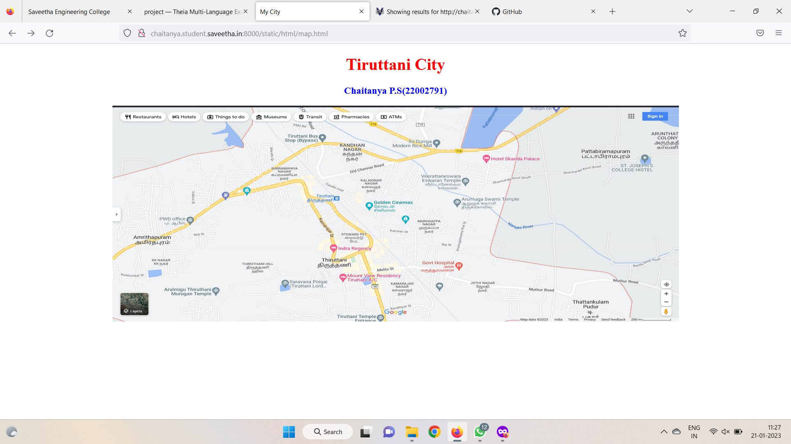

# Places Around Me
## AIM:
To develop a website to display details about the places around my house.

## Design Steps:

### Step 1:
Clone the git repository into Theia IDE

### Step 2:
Create a new Django project

### Step 3:
Write the needed HTML code

### Step 4:
Run the Django server and execute the HTML files.

## Code:
```

map.html
<!DOCTYPE html>
<html lang="en">
<head>
<title>My City</title>
</head>
<body>
<h1 align="center">
<font color="red"><b>Tiruttani City</b></font>
</h1>
<h3 align="center">
<font color="blue"><b>Chaitanya P.S(22002791)</b></font>
</h3>
<center>

<map name="MyCity">
<area shape="circle" coords="190,50,20" href="/static/html/iry.html" title="Indra Regency">
<area shape="rectangle" coords="230,30,260,60" href="/static/html/gh.html"Government Hostipal">
<area shape="circle" coords="400,350,50" href="/static/html/gc.html" title="Golden Cinemas">
<area shape="circle" coords="400,200,75" href="/static/html/bus.html" title="Tiruttani Bus stand">
<area shape="rectangle" coords="490,150,870,320" href="/static/html/vet.html" title="Veerattaneswara Eswaran Temple">
</map>
</center>
</body>
</html>

bus.html
<!DOCTYPE html>
<html lang="en">
<head>
<title>Bus Stand</title>
</head>
<body bgcolor="cyan">
<h1 align="center">
<font color="red"><b>Tiruttani - Town city</b></font>
</h1>
<h3 align="center">
<font color="blue"><b>Bus Stand</b></font>
</h3>
<hr size="3" color="red">
<p align="justify">
<font face="Courier New" size="5">
<b>
Tiruttani is an administrative district, one of the 38 districts in the 
state of Tamil Nadu in India. The district headquarters is located at Thiruvallur. 
The district encompasses an area of 1,949.31 km². Gangaikonda Cholapuram, 
built by King Rajendra Cholan of Chola Empire, is a UNESCO World Heritage site 
situated in this district. The district is also known for its rich prehistoric 
fossils. Many fossils of gigantic molluscs and jawed fishes, at least one 
fossilized dinosaur egg, and several fragmentary fossils of sauropod and theropod 
dinosaurs have been discovered here. An on-site museum is being set up at 
Keelapazhur to preserve and conserve fossils. Ariyalur is noted for its cement
 industries and Jayankondam has huge reserves of lignite.
</b>
</font>
</p>
</body>
</html>

gc.html
<!DOCTYPE html>
<html lang="en">
<head>
<title>Golden Cinemas</title>
</head>
<body bgcolor="yellow">
<h1 align="center">
<font color="red"><b>Tiruttani - Town city</b></font>
</h1>
<h3 align="center">
<font color="blue"><b>Golden Cinemas</b></font>
</h3>
<hr size="3" color="red">
<p align="justify">
<font face="Tahoma" size="5">
Many people find watching movies both entertaining and a way to reduce stress. Watching movies can make us forget our problems is an alternative to anxiety loss. As previously said, watching movies can have a positive emotional impact. Movies can calm us down and soothe us. We reduce the stress within us by lowering worry, and even watching a movie may turn all negative thoughts into the better, as long as it is enjoyable.
</font>
</p>
</body>
</html>

gh.html
<!DOCTYPE html>
<html lang="en">
<head>
<title>Government Hostipal</title>
</head>
<body bgcolor="lime">
<h1 align="center">
<font color="red"><b> Tiruttani - Town city </b></font>
</h1>
<h3 align="center">
<font color="blue"><b>Government Hospital </b></font>
</h3>
<hr size="3" color="red">
<p align="justify">
<font face="Georgia" size="5">
The main objectives of Tiruttani Government hospital are 
<ul>
<li>Diagnosing and treating diseases..</li>
<li> Surgery for patients requiring an operation..</li>
<li>Medicines from government dispensaries.</li>
<li>Immunisation for children against many preventable diseases</li>
</ul>
</font>
</p>
</body>
</html>

iry.html
<!DOCTYPE html>
<html lang="en">
<head>
<title>Indra Regency</title>
</head>
<body bgcolor="pink">
<h1 align="center">
<font color="red"><b>Tiruttani - Town city</b></font>
</h1>
<h3 align="center">
<font color="blue"><b>Indra Regency</b></font>
</h3>
<hr size="3" color="red">
<p align="justify">
<font face="Arial" size="5">
<b>
Indra Regency is one of the leading hotels in Tiruttani offering great amenities and facilities. Indra Regency provides an instant online reservation. So get fast and secure online reservation and then enjoy excellent accommodation in our hotel. If you are searching for budget hotels in Tiruttani then Indra Regency is your right choice. .
</b>
</font>
</p>
</body>
</html>

vet.html
<!DOCTYPE html>
<html lang="en">
<head>
<title>Veerattaneswara Eswaran Temple</title>
</head>
<body bgcolor="orange">
<h1 align="center">
<font color="red"><b>Tiruttani - Town city</b></font>
</h1>
<h3 align="center">
<font color="blue"><b>Veerattaneswara Eswaran Temple</b></font>
</h3>
<hr size="3" color="red">
<p align="justify">
<font face="Georgia" size="5">
The Veerattaneswara Eswaran Temple is 
<ol type="1">
<li>Thiruvathigai Veerateeswarar Temple is a Hindu temple dedicated to Shiva. .</li>
<li>It is situated in Thiruvathigai village which is about 2 kilometres east from the town of Panruti in the South Indian state of Tamil Nadu, India.</li>
<li>Shiva is worshiped as Veerattaaneswarar, and is represented by the lingam.</li>
<li>His consort Parvati is depicted as Thiripurasundari..</li>
</ol>
</font>
</p>
</body>
</html>
```

## Output:





## HTML Validator:


## Result:
The program for implementing image map is executed Successfully.